# Mini Warehouse ML – End-to-End Data Engineering Pipeline

Kompleksowy projekt Data Engineering + ML z pełnym pipeline’em ETL działającym w stylu produkcyjnym:

- **Apache Airflow** – orkiestracja
- **MinIO (S3)** – storage plików
- **PostgreSQL** – hurtownia danych w warstwach `bronze / silver / gold / ml`
- **Python + Pandas + scikit-learn + XGBoost** – transformacje i modele
- **SQL** – walidacja, czyszczenie, feature engineering
- **Docker Compose** – pełna infrastruktura lokalna
- **Artifacts** – zapisywanie modeli, metryk, SHAP i predykcji

Całość jest zaprojektowana jako **portfolio-quality project**.

---

## Spis treści

1. [Architektura](#architektura)
2. [Struktura repozytorium](#struktura-repozytorium)
3. [Warstwy hurtowni danych](#warstwy-hurtowni-danych)
4. [ERD – zależności między tabelami (Mermaid)](#erd--zależności-między-tabelami-mermaid)
5. [Setup – środowisko lokalne](#setup--środowisko-lokalne)
   - [Krok 1 – instalacje zależności](#krok-1--instalacje-zależności)
   - [Krok 2 – plik `.env`](#krok-2--plik-env)
   - [Krok 3 – generowanie kluczy](#krok-3--generowanie-kluczy)
   - [Krok 4 – uruchomienie Docker Compose](#krok-4--uruchomienie-docker-compose)
7. [DAG Airflow – warehouse_daily](#dag-airflow--warehouse_daily)
8. [Warstwa ML – trenowanie modeli i predykcje](#warstwa-ml--trenowanie-modeli-i-predykcje)
   - [Trenowanie i wybór najlepszego modelu](#trenowanie-i-wybór-najlepszego-modelu)
   - [Feature importance](#feature-importance)
   - [SHAP – interpretowalność modelu](#shap--interpretowalność-modelu)
   - [Predykcje nowych mieszkań](#predykcje-nowych-mieszkań)
9. [Artefakty ML – co zostaje zapisane](#artefakty-ml--co-zostaje-zapisane)
10. [Wizualizacje projektu](#wizualizacje-projektu)
11. [Restart / zatrzymanie środowiska](#restart--zatrzymanie-środowiska)

---

## Architektura

**High-level:**

```text
Raw CSV
  ↓
Bronze (Pandas → Parquet → MinIO)
  ↓
Silver (SQL: typing, cleaning, validation)
  ↓
Gold (Feature engineering, KPI views, dane do ML)
  ↓
ML (trenowanie modeli, feature importance, SHAP, predykcje)

# 📁 Struktura repozytorium
```
Całością steruje DAG Airflow: warehouse_daily.

## Struktura repozytorium
```
mini-warehouse-ml/
├── docker-compose.airflow.yml
├── docker-compose.yml
│
├── airflow/                 # konfiguracja Airflow + docker-compose dla orkiestracji
│   ├── dags/
│   │   └── warehouse_dag.py # główny DAG: bronze → silver → gold → ML
│   │   └── __pycache__
│   │	│   └── warehouse_dag.cpython-312.pyc
│   ├── logs
│   │	└── dag_processor_manager
│   │	└── scheduler
│   │	└── dag_id=warehouse_daily
│   ├── home
│
├── etl/                     # ETL w Pythonie (bronze + integracja z MinIO)
│   ├── extract.py           # CSV → MinIO
│   ├── transform.py         # pandas → Parquet
│   └── load.py              # Parquet → Postgres (bronze.housing_raw)
│   └── load_raw.py 		 # Surowy plik csv -> cały proces "ETL" po stronie SQL
│
├── SQL/                     # SQL dla warstw silver / gold / walidacji
│   ├── SQL_raw/			# SQL-owy ETL 
│   │   └── 00_discovery/		# ekspolarcja danych raw
│   │	│   └── 010_schema_overview.sql
│   │	│   └── 020_null_heatmap.sql
│   │	│   └── 030_basix_statistics.sql
│   │   └── 01_staging/			# czyszczenie i standaryzacja			
│   │	│   └── 110_handle_missing_values.sql
│   │	│   └── 120_cast_and_normalize.sql
│   │	│   └── 130_handle_logic.sql
│   │   └── 02_gold/			# features, KPIs, outliers
│   │	│   └── 210_gold_feature.sql
│   │	│   └── 220_gold_valid.sql
│   │	│   └── 230_gold_invalid.sql
│   │	│   └── 240_price_city_daily.sql
│   │	│   └── 250_gold_outliers_iqr.sql
│   │	│   └── 260_gold_duplicates.sql
│   │	│   └── 270_gold_kpi.sql
│   ├── SQL_after_etl/          # SQL po Python ETL
│   │   └── 01_quality_checks.sql
│   │   └── 02_standarize_types.sql
│   │   └── 03_outliers_check.sql
│   │   └── 04_buisness_logic_cleaning.sql
│   │   └── 05_final_view.sql 
│
├── ml/                      # część ML
│   ├── ml_final.py          # trenowanie modeli + wybór najlepszego + log runów
│   ├── feature_importance.py# wykres ważności cech
│   ├── shap_explainer.py    # SHAP – interpretacja modelu
│   └── predict_sample.py    # predykcje nowych mieszkań + zapis do DB i Excela
│   └── __pycache__
│   └── artifacts
│
├── artifacts/               # wyjścia z ML (modele, metryki, wykresy, predykcje)
│   └── best_model_*.joblib
│   └── feature_importance.csv
│   └── feature_importance.png
│   └── model_metrics.csv
│   └── predictions_YYYY_MMDD_****.xlsx
│   └── shap_summary.png
│   └── shap_values.csv
│
├── data/                    # dane wejściowe 
│   └── raw
│      └── housing_10k_sample.csv
│      └── housing_800k.csv
│
├── notebooks/               # praca eksploracyjna
│   └── explore_raw.ipynb
│
├── warehouse/               # dodatkowe materiały dot. ERD
│   └── erd.md
│
├── requirements.txt         # zależności Pythona (ML + lokalne skrypty)
└── README.md
```
### Warstwy hurtowni danych

**Bronze — Raw Layer**

Warstwa **BRONZE** zawiera dane „as-is”, w formie najbardziej zbliżonej do źródła, bez walidacji i bez typowania.
Zawartość:
- bronze.housing_raw
Cechy:
- ✔ brak typów
- ✔ brak walidacji
- ✔ pełne dane surowe

⸻

**Silver — Clean Layer**

Warstwa **SILVER** zawiera dane oczyszczone, otagowane typami oraz gotowe do dalszego wzbogacania.
Zawartość (views):
- silver.housing_clean – dane po walidacji, usunięte wartości błędne
- silver.housing_typed – ujednolicone typy, poprawione formaty dat/liczb
Cechy transformacji:
- usuwanie błędnych rekordów
- konwersja typów
- normalizacja kolumn
- wstępne łączenie danych

⸻

**Gold — Feature Layer**

Warstwa **GOLD** jest używana do analiz biznesowych i trenowania modeli ML.
Tabele:
- gold.housing_features – główna tabela cech numerycznych i kategorycznych
- gold.outliers_iqr – wykryte obserwacje odstające
- gold.price_city_daily – dzienne statystyki cenowe per miasto
Widoki:
- gold.clean – dane przefiltrowane, przygotowane do dalszej analizy
- gold.housing_valid – ostateczny zbiór treningowo-walidacyjny dla modeli ML

⸻

### ML — Model Predictions & Metadata

Schemat ML przechowuje wyniki predykcji oraz metadane treningów modeli.
- ml.housing_predictions
Predykcje wygenerowane przez najlepszy model:
- listing_id
- predicted_price_total
- scored_at
- model_path
- ml.model_runs
Log każdego treningu modelu:
- run_id
- model_name
- mae, rmse, r2
- train_rows, valid_rows
- scored_at
- pipeline_sha (hash pliku modelu)
---

### Podsumowanie warstw hurtowni danych

| Warstwa | Typ     | Obiekty                                                                 | Cel                                   |
|---------|---------|--------------------------------------------------------------------------|----------------------------------------|
| Bronze  | tabela  | `bronze.housing_raw`                                                     | dane surowe, źródłowe                  |
| Silver  | widoki  | `silver.housing_clean`, `silver.housing_typed`                           | czyszczenie, typowanie                 |
| Gold    | tabele  | `gold.housing_features`, `gold.outliers_iqr`, `gold.price_city_daily`    | cechy, agregacje, statystyki           |
| Gold    | widoki  | `gold.clean`, `gold.housing_valid`                                       | finalne dane do ML                     |
| ML      | tabele  | `ml.housing_predictions`, `ml.model_runs`                                | predykcje i metadane modeli            |


##  ERD – zależności między tabelami (Mermaid)

```mermaid
flowchart TD

  subgraph BRONZE ["Bronze – Raw"]
    B1["bronze.housing_raw"]
  end

  subgraph SILVER ["Silver – Clean"]
    S1["silver.housing_typed"]
    S2["silver.housing_clean"]
  end

  subgraph GOLD ["Gold – Features & Views"]
    G1["gold.housing_features"]
    G2["gold.outliers_iqr"]
    G3["gold.price_city_daily"]
    GV1["gold.clean"]
    GV2["gold.housing_valid"]
  end

  subgraph ML ["ML – Predictions & Runs"]
    M1["ml.housing_predictions"]
    M2["ml.model_runs"]
  end

  %% przepływ danych
  B1 --> S1 --> S2 --> G1
  G1 --> GV1 --> GV2
  G1 --> G2
  G1 --> G3

  %% dane do ML
  GV2 --> M1
  GV2 --> M2
```



## Setup – środowisko lokalne

**Wymagania**
	•	Docker + Docker Compose
	•	Python 3.10–3.12 (do lokalnego uruchamiania skryptów ML)
	•	PostgreSQL lokalnie (jeśli chcesz podglądać dane poza kontenerem)

### Krok 1 – instalacje zależności
**Instalacja zależności Python (dla lokalnego uruchamiania ML)**

W celu uruchomienia skryptów lokalnie, należy wykonać komende poniżej:
```bash
python3 -m venv .venv
source .venv/bin/activate        # macOS/Linux
# lub
.venv\Scripts\activate           # Windows

pip install -r requirements.txt
```


### Krok 2 – plik .env

W katalogu głównym projektu:
```bash
cp airflow/.env.example airflow/.env
nano airflow/.env
```
Uzupełnij wartości:

**Sekcja bezpieczeństwa:**
```bash
AIRFLOW__CORE__FERNET_KEY=<WSTAW_TUTAJ_FERNET_KEY>
AIRFLOW__WEBSERVER__SECRET_KEY=<WSTAW_TUTAJ_SECRET_KEY>
```

**Dane logowania do Airflow:**
```bash
_AIRFLOW_WWW_USER_CREATE=True
_AIRFLOW_WWW_USER_USERNAME=admin
_AIRFLOW_WWW_USER_PASSWORD=admin123
```

**Połączenie do Postgresa z DAG-a:**
```bash
PG_HOST=host.docker.internal
PG_PORT=5432
PG_USER=postgres
PG_PASSWORD=postgres
PG_DB=warehouse
```

**MinIO:**
```bash
MINIO_ROOT_USER=admin
MINIO_ROOT_PASSWORD=admin12345
S3_ENDPOINT=http://host.docker.internal:9000
```

### Krok 3 – generowanie kluczy

**Fernet Key:**
```bash
python3 - <<'EOF'
from cryptography.fernet import Fernet
print(Fernet.generate_key().decode())
EOF
```

**Secret Key:**
```bash
openssl rand -hex 64
```

Wygenerowane wartości należy wkleić do airflow/.env.

### Krok 4 - uruchomienie Docker Compose 

```bash
docker compose -f docker-compose.airflow.yml up -d
```

Airflow UI będzie dostępny pod adresem:
*http://localhost:8081*

Dane logowania:
```bash
Username: admin
Password: admin123
```

### Trouble shooting - problemy z logowaniem do Airflow

Jeśli domyślne logowanie nie działa (np. po zmianie `_AIRFLOW_WWW_USER_*` albo pierwszym starcie kontenera), można zresetować hasło z poziomu Dockera:

1. Wejście do konternera Airflow:
```bash
docker compose -d docker-compose.airflow.yml exec airflow bash
```

2. Uruchamianie skryptu zmiany hasła:
```bash
airflow users reset-password -u admin
```
Należy podac nowe hasło, a następnie je powtórzyć.

3. Wyjście z kontera:
```bash
exit
```

## DAG Airflow – warehouse_daily

Po włączeniu DAG-a warehouse_daily w UI Airflow, pipeline wykona kolejno:
1.	**Extract** – wrzucenie lokalnego CSV do MinIO
2.	**Transform** – przetworzenie do Parquet (Pandas)
3.	**Load** – import do Postgresa: bronze.housing_raw
4.	**Silver** – handle_missing_values – uzupełnianie/obsługa braków
5.	**Silver** – cast_and_normalize – typowanie i normalizacja pól
6.	**Silver** – logic checks – reguły biznesowe i jakościowe
7.	**Gold** – features – tworzenie cech (m.in. floor_ratio, season, area_sqm_bucket)
8.	**Gold** – valid/invalid/duplicates – widoki kontrolne
9.	**ML** – train_models – trenowanie modeli i zapis artefaktów
10.	**ML** – feature_importance_ml – generacja wykresu ważności cech
11.	**ML** – shap_explainer_ml – obliczenie SHAP i zapis wykresu
12.	**ML** – Model_prediction_sample – predykcja nowych mieszkań + zapis do DB i Excela

## Warstwa ML – trenowanie modeli i predykcje

### **Trenowanie i wybór najlepszego modelu**

Skrypt: ml/ml_final.py

Modele:
- RandomForestRegressor
- GradientBoostingRegressor
- XGBRegressor

Wykonywane kroki:
1.	Pobranie danych z gold.housing_valid
2.	Podział na train / valid / test
3.	Zbudowanie preprocessora (ColumnTransformer – num + cat)
4.	RandomizedSearchCV dla każdego modelu (MAE jako metryka)
5.	Wybór najlepszego modelu (najniższe MAE na valid)
6.	Zapis pipeline’u do artifacts/best_model_<Model>.joblib
7.	Wyliczenie SHA256 pipeline’u i zapis do ml.model_runs

### **Feature importance**

Skrypt: ml/feature_importance.py
- ładuje best_model_*.joblib z katalogu artifacts/
- wyciąga feature_importances_
- zapisuje:
	- artifacts/feature_importance.csv
	- artifacts/feature_importance_top20.png – wykres TOP 20 cech

### **SHAP – interpretowalność modelu**

Skrypt: ml/shap_explainer.py
- pobiera próbkę danych z gold.housing_valid
- używa TreeExplainer (SHAP) dla najlepszego modelu
- zapisuje:
	- artifacts/shap_values.csv
	- artifacts/shap_summary.png – wykres mean(|SHAP value|) dla top cech

### **Predykcje nowych mieszkań**

Skrypt: ml/predict_sample.py
1.	Pobiera N losowych rekordów z gold.housing_valid
2.	Odrzuca kolumnę price_total (target)
3.	Wylicza predykcje predicted_price_total przy użyciu najlepszego modelu
4.	Zapisuje wyniki do:
	- Postgres: ml.housing_predictions
	- Excela: artifacts/predictions_<YYYYMMDD_HHMM>.xlsx

Przykładowe kolumny:
- listing_id
- predicted_price_total
- scored_at (UTC)
- model_path (np. best_model_RandomForest.joblib)

## Artefakty ML – co zostaje zapisane

W katalogu artifacts/ powinno być widoczne m.in.:
**Modele i metryki:**
- best_model_<Model>.joblib
- model_metrics.csv
- feature_importance.csv
- feature_importance_top20.png
**SHAP:**
- shap_values.csv
- shap_summary.png
**Predykcje**:
- predictions_<YYYYMMDD_HHMM>.xlsx

## Wizualizacje projektu

### Airflow – widok główny DAG-a


### Airflow – Graph View


### Airflow – task trenowania modeli


### MinIO – Buckety


## Restart / zatrzymanie środowiska

Zatrzymanie kontenerów:
```bash
docker compose -d docker-compose.airflow.yml down
```

Uruchomienie ponowne:
```bash
docker compose -d docker-compose.airflow.yml up -d
```
---

## Autor

Projekt został w całości zaprojektowany, zaimplementowany i udokumentowany przez:

**Mateusz Wykowski**  
Data Engineer & ML Enthusiast

Repozytorium stanowi element portfolio i pokazuje praktyczną implementację:
- end-to-end pipeline'u ETL w architekturze bronze → silver → gold,
- orkiestracji z użyciem Apache Airflow,
- integracji z MinIO (S3),
- przetwarzania danych w Pythonie i SQL,
- pełnego cyklu ML: preprocessing, trenowanie, ewaluacja, SHAP, predykcje,
- oraz projektowych dobrych praktyk Data Engineering.

Kontakt: **MateusWykowski@gmail.com**

---
