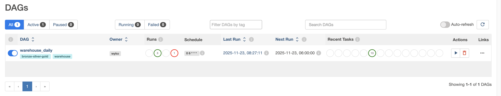
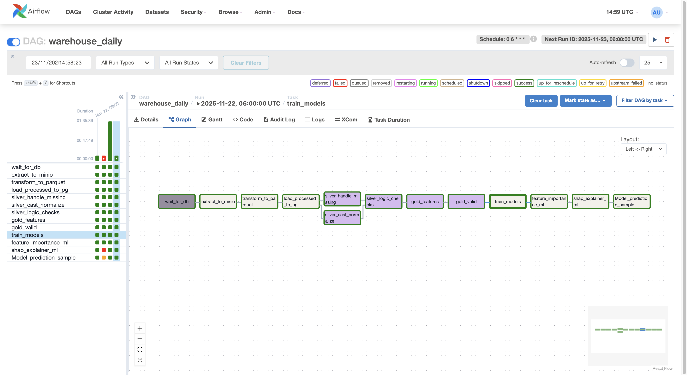
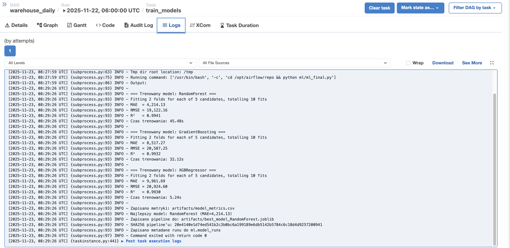
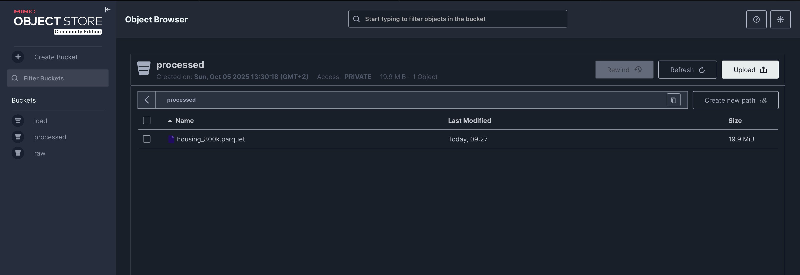

# Mini Warehouse ML – End-to-End Data Engineering Pipeline (English Version)

A comprehensive **Data Engineering + Machine Learning** project featuring a fully production‑style ETL pipeline:

- **Apache Airflow** – workflow orchestration
- **MinIO (S3)** – object storage
- **PostgreSQL** – multi-layer data warehouse (bronze / silver / gold / ml)
- **Python + Pandas + scikit‑learn + XGBoost** – data processing & modeling
- **SQL** – data validation, cleaning, feature engineering
- **Docker Compose** – complete local infrastructure
- **Artifacts** – model files, metrics, SHAP values, predictions

Designed as a **portfolio-quality project**.

---

## Table of Contents

1. [Architecture](#architecture)
2. [Repository Structure](#repository-structure)
3. [Data Warehouse Layers](#data-warehouse-layers)
4. [ERD – Mermaid Diagram](#erd--mermaid-diagram)
5. [Local Environment Setup](#local-environment-setup)
   - [Step 1 – Install Python dependencies](#step-1--install-python-dependencies)
   - [Step 2 – Configure `.env`](#step-2--configure-env)
   - [Step 3 – Generate keys](#step-3--generate-keys)
   - [Step 4 – Run Docker Compose](#step-4--run-docker-compose)
6. [Airflow DAG – warehouse_daily](#airflow-dag--warehouse_daily)
7. [ML Layer – Model Training & Predictions](#ml-layer--model-training--predictions)
   - [Training and Selecting the Best Model](#training-and-selecting-the-best-model)
   - [Feature importance](#feature-importance)
   - [SHAP analysis](#shap-analysis)
   - [Predictions](#predictions)
8. [ML Artifacts](#ml-artifacts)
9. [Project Screenshots](#project-screenshots)
10. [Restarting the Environment](#restarting-the-environment)
11. [Author](#author)

---

## Architecture

**High-level flow:**

```
Raw CSV
  ↓
Bronze (Pandas → Parquet → MinIO)
  ↓
Silver (SQL: typing, cleaning, validation)
  ↓
Gold (Feature engineering, KPI views, ML-ready data)
  ↓
ML (training, SHAP, predictions, artifacts)
```

The entire workflow is controlled by the **Airflow DAG: `warehouse_daily`**.

---

## Repository Structure

```
mini-warehouse-ml/
├── docker-compose.airflow.yml
├── docker-compose.yml
│
├── airflow/                 # konfiguracja Airflow + docker-compose dla orkiestracji
│   ├── dags/
│   │   └── warehouse_dag.py # główny DAG: bronze → silver → gold → ML
│   │   └── __pycache__
│   │	│   └── warehouse_dag.cpython-312.pyc
│   ├── logs
│   │	└── dag_processor_manager
│   │	└── scheduler
│   │	└── dag_id=warehouse_daily
│   ├── home
│
├── etl/                     # ETL w Pythonie (bronze + integracja z MinIO)
│   ├── extract.py           # CSV → MinIO
│   ├── transform.py         # pandas → Parquet
│   └── load.py              # Parquet → Postgres (bronze.housing_raw)
│   └── load_raw.py 		 # Surowy plik csv -> cały proces "ETL" po stronie SQL
│
├── SQL/                     # SQL dla warstw silver / gold / walidacji
│   ├── SQL_raw/			# SQL-owy ETL
│   │   └── 00_discovery/		# ekspolarcja danych raw
│   │	│   └── 010_schema_overview.sql
│   │	│   └── 020_null_heatmap.sql
│   │	│   └── 030_basix_statistics.sql
│   │   └── 01_staging/			# czyszczenie i standaryzacja
│   │	│   └── 110_handle_missing_values.sql
│   │	│   └── 120_cast_and_normalize.sql
│   │	│   └── 130_handle_logic.sql
│   │   └── 02_gold/			# features, KPIs, outliers
│   │	│   └── 210_gold_feature.sql
│   │	│   └── 220_gold_valid.sql
│   │	│   └── 230_gold_invalid.sql
│   │	│   └── 240_price_city_daily.sql
│   │	│   └── 250_gold_outliers_iqr.sql
│   │	│   └── 260_gold_duplicates.sql
│   │	│   └── 270_gold_kpi.sql
│   ├── SQL_after_etl/          # SQL po Python ETL
│   │   └── 01_quality_checks.sql
│   │   └── 02_standarize_types.sql
│   │   └── 03_outliers_check.sql
│   │   └── 04_buisness_logic_cleaning.sql
│   │   └── 05_final_view.sql
│
├── ml/                      # część ML
│   ├── ml_final.py          # trenowanie modeli + wybór najlepszego + log runów
│   ├── feature_importance.py# wykres ważności cech
│   ├── shap_explainer.py    # SHAP – interpretacja modelu
│   └── predict_sample.py    # predykcje nowych mieszkań + zapis do DB i Excela
│   └── __pycache__
│   └── artifacts
│
├── artifacts/               # wyjścia z ML (modele, metryki, wykresy, predykcje)
│   └── best_model_*.joblib
│   └── feature_importance.csv
│   └── feature_importance.png
│   └── model_metrics.csv
│   └── predictions_YYYY_MMDD_****.xlsx
│   └── shap_summary.png
│   └── shap_values.csv
│
├── data/                    # dane wejściowe
│   └── raw
│      └── housing_10k_sample.csv
│      └── housing_800k.csv
│
├── notebooks/               # praca eksploracyjna
│   └── explore_raw.ipynb
│
├── warehouse/               # dodatkowe materiały dot. ERD
│   └── erd.md
│
├── requirements.txt         # zależności Pythona (ML + lokalne skrypty)
└── README.md
```

---

## Data Warehouse Layers

### **Bronze — Raw Layer**

The **BRONZE** layer contains the data as-is, in the form closest to the original source, without validation or type casting.
Contents:

- bronze.housing_raw

Characteristics:

- ✔ no type casting
- ✔ no validation
- ✔ full raw data preserved

---

### **Silver — Clean Layer**

Contains cleaned and typed datasets ready for enrichment.

**Views:**

- `silver.housing_clean` – cleaned, validated rows
- `silver.housing_typed` – standardized datatypes

**Transformations include:**

- removing invalid records
- type conversions
- normalization
- preliminary business-rule corrections

---

### **Gold — Feature Layer**

Final analytical and ML-ready datasets.

**Tables:**

- `gold.housing_features` – core feature table
- `gold.outliers_iqr` – detected outliers
- `gold.price_city_daily` – daily price statistics

**Views:**

- `gold.clean` – filtered, validated dataset
- `gold.housing_valid` – ML training/validation dataset

---

### **ML — Predictions & Metadata**

**Tables:**

- `ml.housing_predictions`
- `ml.model_runs`

Metadata stored per training run:

- run_id
- model_name
- mae, rmse, r2
- train_rows / valid_rows
- scored_at
- pipeline_sha

---

### Summary of the data warehouse layers

| Layer  | Type   | Objects                                                               | Purpose                            |
| ------ | ------ | --------------------------------------------------------------------- | ---------------------------------- |
| Bronze | table  | `bronze.housing_raw`                                                  | raw, source data                   |
| Silver | views  | `silver.housing_clean`, `silver.housing_typed`                        | cleaning, type casting             |
| Gold   | tables | `gold.housing_features`, `gold.outliers_iqr`, `gold.price_city_daily` | features, aggregations, statistics |
| Gold   | views  | `gold.clean`, `gold.housing_valid`                                    | final ML-ready datasets            |
| ML     | tables | `ml.housing_predictions`, `ml.model_runs`                             | predictions and model metadata     |

## ERD – Mermaid Diagram

```
flowchart TD

  subgraph BRONZE ["Bronze – Raw"]
    B1["bronze.housing_raw"]
  end

  subgraph SILVER ["Silver – Clean"]
    S1["silver.housing_typed"]
    S2["silver.housing_clean"]
  end

  subgraph GOLD ["Gold – Features & Views"]
    G1["gold.housing_features"]
    G2["gold.outliers_iqr"]
    G3["gold.price_city_daily"]
    GV1["gold.clean"]
    GV2["gold.housing_valid"]
  end

  subgraph ML ["ML – Predictions & Runs"]
    M1["ml.housing_predictions"]
    M2["ml.model_runs"]
  end

  %% Pipeline
  B1 --> S1 --> S2 --> G1
  G1 --> GV1 --> GV2
  G1 --> G2
  G1 --> G3

  %% Data flow to ML
  GV2 --> M1
  GV2 --> M2
```

---

## Local Environment Setup

**Requirements**
• Docker + Docker Compose
• Python 3.10–3.12 (for running ML scripts locally)
• PostgreSQL installed locally (optional — only if you want to inspect data outside the container)

### Step 1 – Install Python dependencies

To run the scripts locally, execute the following commands:

```bash
python3 -m venv .venv
source .venv/bin/activate   # macOS/Linux
# or
.venv\Scripts\activate      # Windows

pip install -r requirements.txt
```

---

### Step 2 – Configure .env

In the root directory of the project:

```bash
cp airflow/.env.example airflow/.env
```

Edit:

```bash
nano airflow/.env
```

Fill in:

- Airflow credentials

```bash
AIRFLOW__CORE__FERNET_KEY=<WSTAW_TUTAJ_FERNET_KEY>
AIRFLOW__WEBSERVER__SECRET_KEY=<WSTAW_TUTAJ_SECRET_KEY>
```

- Postgres connection

```bash
PG_HOST=host.docker.internal
PG_PORT=5432
PG_USER=postgres
PG_PASSWORD=postgres
PG_DB=warehouse
```

- MinIO config

```bash
MINIO_ROOT_USER=admin
MINIO_ROOT_PASSWORD=admin12345
S3_ENDPOINT=http://host.docker.internal:9000
```

---

### Step 3 – Generate Keys

**Fernet Key**

```bash
python3 - <<'EOF'
from cryptography.fernet import Fernet
print(Fernet.generate_key().decode())
EOF
```

**Airflow Secret Key**

```bash
openssl rand -hex 64
```

The generated values should be pasted into airflow/.env.

---

### Step 4 – Run Docker Compose

```bash
docker compose -f docker-compose.airflow.yml up -d
```

Airflow UI → `http://localhost:8081`

Log in credentials:

```bash
Username: admin
Password: admin123
```

### Troubleshooting – Problems Logging Into Airflow

If the default login does not work (for example, after modifying `_AIRFLOW_WWW_USER_*`or during the container’s first startup), you can reset the password directly inside the Docker container:

1. Enter the Airflow container:

```bash
docker compose -d docker-compose.airflow.yml exec airflow bash
```

2. Run the password-reset command:

```bash
airflow users reset-password -u admin
```

You will be prompted to enter a new password and confirm it.

3. Exit the container:

```bash
exit
```

---

## Airflow DAG – `warehouse_daily`

After enabling the warehouse_daily DAG in the Airflow UI, the pipeline will execute the following steps:

1. **Extract** – upload the local CSV file to MinIO
2. **Transform** – convert the file to Parquet (Pandas)
3. **Load** – import data into Postgres: bronze.housing_raw
4. **Silver** – handle_missing_values – filling/handling missing data
5. **Silver** – cast_and_normalize – type casting and field normalization
6. **Silver** – logic_checks – business and data quality rules
7. **Gold** – features – feature creation (e.g., floor_ratio, season, area_sqm_bucket)
8. **Gold** – valid/invalid/duplicates – control validation views
9. **ML** – train_models – model training and artifact saving
10. **ML** – feature_importance_ml – generation of feature importance plots
11. **ML** – shap_explainer_ml – SHAP computation and plot saving
12. **ML** – Model_prediction_sample – prediction of new apartments + saving to DB and Excel

---

## ML Layer – Model Training & Predictions

### **Training and Selecting the Best Model**

Script: ml/ml_final.py

Models used:

- RandomForestRegressor
- GradientBoostingRegressor
- XGBRegressor

Steps performed:

1. Load training data from gold.housing_valid
2. Split into train / validation / test sets
3. Build the preprocessing pipeline (ColumnTransformer – numeric + categorical features)
4. Run RandomizedSearchCV for each model (MAE as the evaluation metric)
5. Select the best model (lowest MAE on the validation set)
6. Save the full pipeline to artifacts/best*model*<Model>.joblib
7. Compute the model pipeline’s SHA256 hash and log it to ml.model_runs

### **Feature Importance**

Script: ml/feature_importance.py

- Loads best*model*\*.joblib from the artifacts/ directory
- Extracts feature*importances*
- Saves output files:
  - artifacts/feature_importance.csv
  - artifacts/feature_importance_top20.png – TOP 20 most important features plotFeature Importance

### **SHAP – Model Interpretability**

Script: ml/shap_explainer.py

- Loads a sample of data from gold.housing_valid
- Uses SHAP TreeExplainer for the best model
- Saves:
  - artifacts/shap_values.csv
  - artifacts/shap_summary.png – mean(|SHAP value|) summary plot for top features

### **Predictions for New Apartments**

Script: ml/predict_sample.py

1. Fetches N random rows from gold.housing_valid
2. Drops the price_total column (target)
3. Computes predicted_price_total using the best model
4. Saves results to:
   - PostgreSQL: ml.housing_predictions
   - Excel: artifacts/predictions\_<YYYYMMDD_HHMM>.xlsx

Example output columns:

- listing_id
- predicted_price_total
- scored_at (UTC timestamp)
- model_path (e.g., best_model_RandomForest.joblib)

---

## ML Artifacts

In the artifacts/ directory you should see the following files, including:

**Models & Metrics**

- best*model*<Model>.joblib
- model_metrics.csv
- feature_importance.csv
- feature_importance_top20.png

**SHAP**

- shap_values.csv
- shap_summary.png

**Predictions**

- predictions\_<YYYYMMDD_HHMM>.xlsx

---

## Project Screenshots

### Airflow – Main DAG View



### Airflow – Graph View



### Airflow – Task Instance of Train Models



### MinIO – Buckets



---

## Restarting the Environment

```bash
docker compose -f docker-compose.airflow.yml down
docker compose -f docker-compose.airflow.yml up -d
```

---

## Author

Project built and documented by:

**Mateusz Wykowski**  
Data Engineer & ML Enthusiast  
Email: **MateusWykowski@gmail.com**

---
