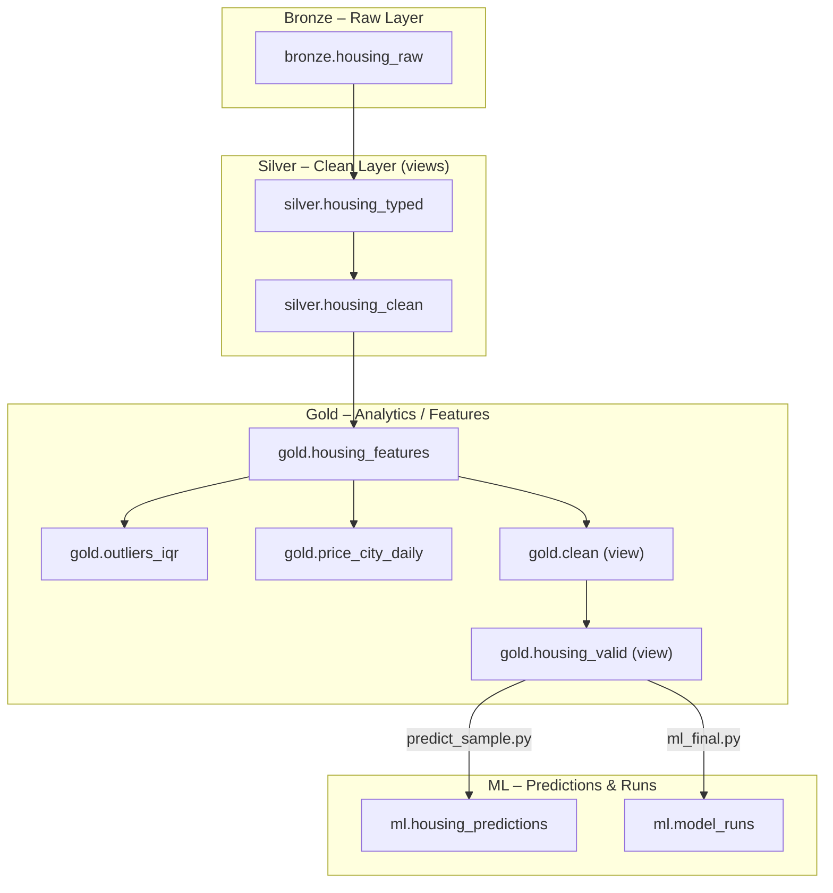

# Mini Warehouse ML – Data Warehouse & ML Pipeline

Poniższy dokument przedstawia pełną architekturę hurtowni danych oraz pipeline ML projektu **Mini Warehouse ML**.

Obejmuje warstwy:

**bronze → silver → gold → ml**

wraz z przepływem danych, walidacją, trenowaniem modeli i generowaniem predykcji.

---

# ERD – Zależności między tabelami (Mermaid)


# Warstwy hurtowni danych

## Bronze — Raw Layer

Warstwa BRONZE zawiera dane „as-is”, w formie najbardziej zbliżonej do źródła, bez walidacji i bez typowania.

Zawartość:
	•	bronze.housing_raw

Cechy:
	•	✔ brak typów
	•	✔ brak walidacji
	•	✔ pełne dane surowe

## Silver — Clean Layer

Warstwa SILVER zawiera dane oczyszczone, otagowane typami oraz gotowe do dalszego wzbogacania.

Zawartość (views):
	•	silver.housing_clean — dane po walidacji, usunięte wartości błędne
	•	silver.housing_typed — ujednolicone typy, poprawione formaty dat/liczb

Cechy transformacji:
	•	usuwanie błędnych rekordów
	•	konwersja typów
	•	normalizacja kolumn
	•	wstępne łączenie danych

##  Gold — Feature Layer (Analytics-Ready)

Warstwa GOLD to finalne, przetworzone dane do analityki i modelowania ML.
Zawiera zarówno tabele obliczeniowe, jak i widoki, które łączą wszystkie elementy w spójny zestaw danych.\

### Tabele

  •	gold.housing_features
→ pełny zestaw cech numerycznych i kategorycznych dla ML
	•	gold.outliers_iqr
→ obliczenia statystyczne IQR, wykorzystywane do walidacji outlierów
	•	gold.price_city_daily
→ dzienne agregacje cen dla miast (analiza trendów)

### Views

  •	gold.clean
→ widok z oczyszczonymi i połączonymi danymi z warstwy silver + cechy z gold
	•	gold.housing_valid
→ finalny zbiór treningowy
→ wykorzystywany w ml_final.py i predict_sample.py

### ML — Model Predictions & Metadata

ml.housing_predictions

Tabela z wynikami predykcji wygenerowanymi przez model ML z pipeline’u:

Zawiera kolumny:
	•	listing_id
	•	predicted_price_total
	•	scored_at
	•	model_path
	•	diff_real_vs_pred 

Tworzone przez skrypt:

```bash
python ml/predict_sample.py
```

ml.model_runs

Logi każdego treningu modelu:

Zawiera:
	•	run_id
	•	model_name
	•	mae, rmse, r2
	•	train_rows, valid_rows
	•	scored_at
	•	pipeline_sha (hash modelu — kontrola wersji)

Tworzone przez skrypt:

```bash
python ml/ml_final.py
```

### Pipeline ML – skrót działania

    1.	Feature engineering (gold_features w Airflow)
    2.	Walidacja (gold_valid)
    3.	Trenowanie modeli (RandomForest, GradientBoosting, XGBoost)
    4.	Wybór najlepszego modelu (najniższe MAE)
    5.	Zapis pipeline’u do artifacts/
    6.	Obliczenie SHA256 pipeline’u
    7.	Zapis wyników do ml.model_runs
    8.	Generowanie predykcji na nowych danych
    9.	Zapis predykcji do DB + Excel

## Podusmowanie warstw

| Warstwa | Typ     | Obiekty                                         | Cel                               |
|---------|---------|--------------------------------------------------|-----------------------------------|
| Bronze  | tabela  | housing_raw                                     | dane surowe, źródłowe             |
| Silver  | widoki  | housing_clean, housing_typed                    | czyszczenie, typowanie            |
| Gold    | tabele  | housing_features, outliers_iqr, price_city_daily | cechy, agregacje, statystyki      |
| Gold    | widoki  | clean, housing_valid                            | finalne dane do ML                |
| ML      | tabele  | housing_predictions, model_runs                 | predykcje i metadane modeli       |

## Struktura katalogów projektu

```bash
mini-warehouse-ml/
│
├── airflow/                # DAG ETL + ML
├── artifacts/              # zapisany pipeline + modele + wykresy
├── data/                   # pliki wejściowe (opcjonalnie)
├── etl/                    # transformacje SQL / Python
├── ml/                     # model ML + SHAP + predykcje
├── notebooks/              # exploratory work & drafts
├── SQL/                    # pełny zestaw DDL/DML do hurtowni
└── requirements.txt        # zależności projektu
```
